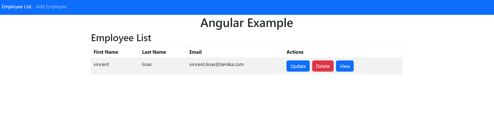

# Angular-example

Application Angular 12/JAVA17.

L'application est une SPA simpliste qui permet de gérer les employées mis à disposition par le webservice du projet  https://gitlab.com/kube-infra-demo/springboot3-example 

## Quelques URLS de l'application
URL locale: http://localhost:4200/ 

## DOCKER COMPOSE
L'application peut être lancée en local  via le gestionnaire de paquet ou via docker

- Lancement via gestionnaire de paquets (ex: npm):

```sh
npm install
npm start
```


Il est égalment possible de lancer l'application via une image générée avec Dockerfile/docker compose.
Il est a noté que l'addresse du webservice REST backend appelé par l'application est configurable dans le fichier .env. 
Par défaut l'url du webservice backend est `http://localhost:8080/

- Lancement via Docker compose;

```sh
docker compose up
```

Visuel de l'application:


## CI/CD
Le projet possède une CI/CD  capable de builder et de releaser l'application. 
Une étape de déployment sur kubernetes est également présente mais reste à terminer faute d'instance kubernetes accessible.

## KUBERNETES
Pour la partie deploiement kubernetes, est est fonctionnelle en local (ex minikube). 
Les containers utilisent les images présentes dans le container registry Gitlab du groupe de projets 

Il y a des fichiers dans le dossier deployment/ pour pouvoir déployer l'application sur kubernetes. 

Fichiers K8S pour l'application:
- app-deployment.yml contient le deploiement de l'application.
  - l'application est exposé via une servie Nodeport et un Ingress.
    - il y a les deux car NotePorte est plus stable que Ingress dans mon minikube sur windows WSL2.
- app-deployment-ci.yml est destiné à être utilisé par la CI/CD de gitlab 


Avant de deployer l'application sur kubernetes il faut avoir intégréer l'url du backend deployé à l'image utilisée.


Les commandes sont présentées ici => https://gitlab.com/kube-infra-demo/springboot3-example/-/blob/main/README.md
